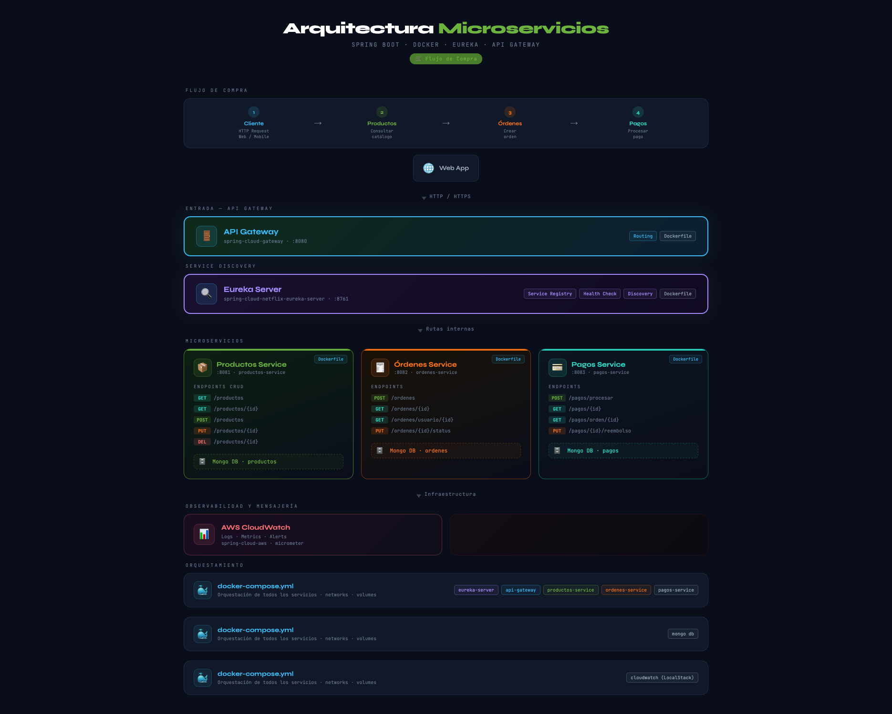

# 🌐 Mejia Examen - Ecosistema de Microservicios

<p align="center">
  
</p>

Este repositorio centraliza la **infraestructura y orquestación** de una arquitectura distribuida de microservicios, diseñada para gestionar un flujo transaccional completo de E-commerce (Productos -> Órdenes -> Pagos).

---

## 🚀 Vista General de la Arquitectura
El sistema utiliza un patrón de **Microservicios Core** apoyados por una infraestructura de servicios auxiliares:

- **Descubrimiento:** Eureka Server para registro dinámico.
- **Enrutamiento:** Spring Cloud Gateway como punto de entrada único.
- **Persistencia:** Instancias independientes de MongoDB.
- **Observabilidad:** LocalStack simulando AWS CloudWatch para logs centralizados.

---

## 📂 Mapa de Repositorios
Cada componente tiene su propio ciclo de vida y responsabilidades:

| Componente | Repositorio | Función Principal |
| :--- | :--- | :--- |
| **Infraestructura** | [Infraestructura-Examen](https://github.com/marielly-garcia-jimenez/Infraestructura-Examen) | Docker Compose y Guías. |
| **Discovery** | [Eureka-Server-Examen](https://github.com/marielly-garcia-jimenez/Eureka-Server-Examen) | Registro de servicios. |
| **Gateway** | [apigateway-Examen](https://github.com/marielly-garcia-jimenez/apigateway-Examen) | Puerta de enlace y filtros. |
| **Productos** | [Productos-Examen](https://github.com/marielly-garcia-jimenez/Productos-Examen) | Catálogo e Inventario. |
| **Órdenes** | [Ordenes-Examen](https://github.com/marielly-garcia-jimenez/Ordenes-Examen) | Gestión de pedidos. |
| **Pagos** | [Pagos-Examen](https://github.com/marielly-garcia-jimenez/Pagos-Examen) | Procesamiento transaccional. |

---

## 🛠️ Guía de Inicio Rápido

### Requisitos Previos
- **Docker Desktop** (con Docker Compose).
- **Java 21** (si deseas compilar localmente).

### Despliegue con un solo comando
Desde la raíz de este proyecto, ejecuta:
```powershell
docker-compose up -d --build
```

### Puertos Clave
- **Dashboard Eureka:** [http://localhost:8761](http://localhost:8761)
- **API Gateway (Entrypoint):** `http://localhost:8080`
- **CloudWatch Logs:** `http://localhost:4566`

---

## 📝 Documentación Adicional
- [Guía Detallada de Construcción](Guide_How_To_Make.md)
- [Examen (Requerimientos)](examen.md)
- [Colección de Postman](Postman_Collection.json) (Importa este archivo para pruebas inmediatas).

---
<p align="center"> Desarrollado para el Examen de Microservicios - 2026 </p>
